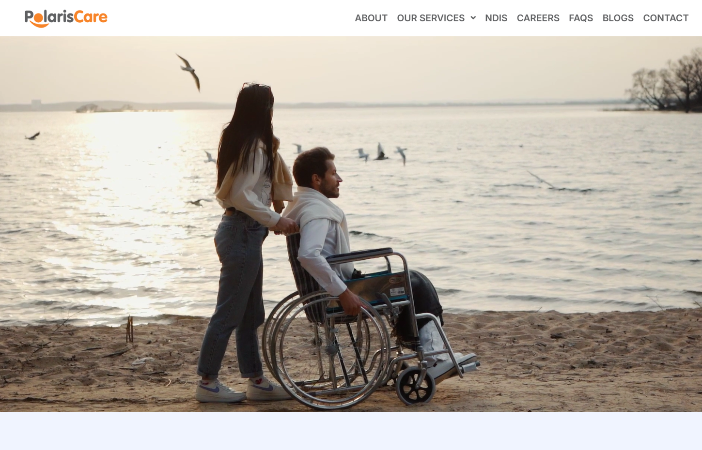

# Polariscare

**Client:** Polaris Care  
**Website:** [polariscare.smartscriptstech.com](https://polariscare.smartscriptstech.com/)  
**Industry:** Disability Support Services  
**Technology Stack:** PHP, MySQL, WordPress, WooCommerce, Elementor, Astra Theme

---
### 🏢 **About the Client**

Polaris Care is a trusted provider of disability support services based in South Morang, Victoria. Dedicated to person-centered, empathetic care, they support NDIS participants across Melbourne, Geelong, and surrounding regions. Their service offerings include:
- In-home and personal care
    
- Social participation
    
- Medication management
    
- Manual handling
    
- Support for complex needs

All services are delivered by qualified, experienced professionals.

---
### 🎯 **Project Goals**

Polaris Care sought to establish a strong digital presence that would:
- Reflect their values and build trust with NDIS participants
    
- Provide clear and accessible information about their services
    
- Be scalable to accommodate growth and future marketing initiatives

---
### 🚧 **The Challenge**

- **Clarity of Communication:** Effectively presenting a wide range of services in a clear, user-friendly way
    
- **Accessibility & Trust:** Creating a website that is inclusive, intuitive, and inspires trust
    
- **Scalability:** Building a future-proof site ready for e-commerce and content marketing
    
- **Technical Stability:** Ensuring the site is fast, secure, mobile-friendly, and SEO-optimized

---
### 💡 **Our Solution**

We developed a modern, responsive WordPress website using the Astra theme and Elementor for flexible design and easy content management. WooCommerce was integrated to allow for potential future service/product listings.

 **Key Features Implemented:**

- Homepage with strong value proposition and clear calls to action
    
- Dedicated service pages for clarity and SEO optimization
    
- Fully mobile-responsive layout
    
- Inquiry forms to boost conversion rates
    
- Google Maps integration for office visibility
    
- Blog-ready CMS for future updates and NDIS news

---
### 📈 **Results**

✅ **Professional Online Presence:** A clean, credible website that reflects Polaris Care's commitment to quality  
✅ **Enhanced User Experience:** Fast loading, easy navigation, and seamless mobile performance  
✅ **Future-Ready Platform:** Built with scalability in mind, ready for content and marketing expansion

---
### 🙎🏻 **Client Feedback**

> _"We are so thrilled with our new website. It captures the values of Polaris Care and provides us with a solid presence in the digital world. The team at Smartscripts made the whole experience easy and stress-free."_  
> — **Polaris Care Team**
